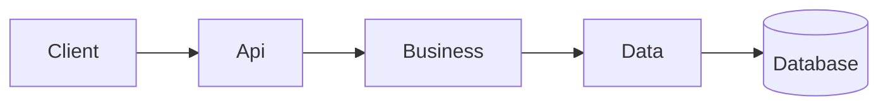

# [System Name] Architecture

## Scope

```txt
[What is being built]
```

---

## Architecture Style

```txt
3-Layer Architecture
[Monolith / Microservices]
Service-oriented design
```

---

## Main Components

| Component | Responsibility |
|---|---|
| Api | Controllers, DTOs, HTTP concerns |
| Business | Services, business logic, orchestration |
| Data | Repositories, database access |

---

## System Overview



---

## Integrations

| Integration | Type | Purpose |
|---|---|---|
| | REST/Event/Batch | |

---

## Constraints

- ...
- ...
- ...