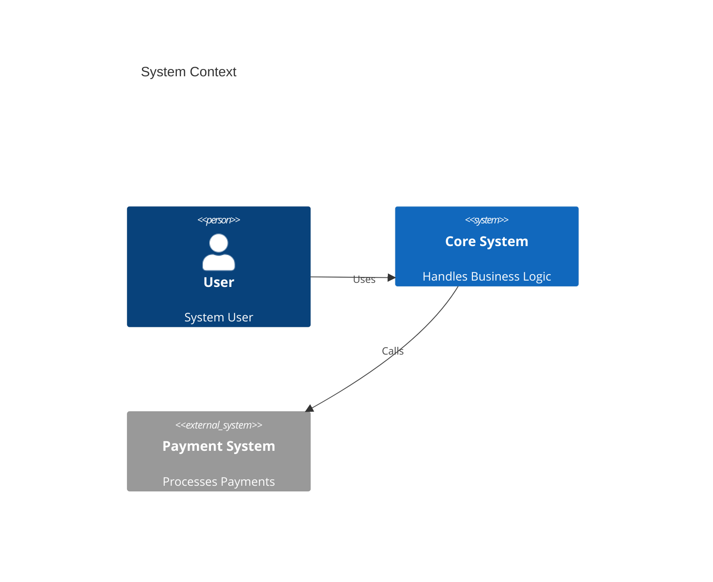

# C4 Model
Short description

## C4 - Context

Create a high level diagram of the system on context level.

```mermaid
C4Context
    title System Context
    Person(user, "User", "System User")
    System(system, "Core System", "Handles Business Logic")
    System_Ext(payment, "Payment System", "Processes Payments")
    Rel(user, system, "Uses")
    Rel(system, payment, "Calls")
```