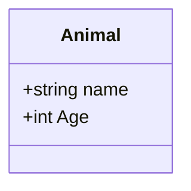

# [System Name] Domain Model

## Domains

| Domain | Responsibility |
|---|---|
| | |

---

## Entities

| Entity | Description |
|---|---|
| | |

---

## Domain Model

Create high level domain model of the connection between classes.

---

## Domain Events

| Event | Trigger |
|---|---|
| | |

---

## Rules

- ...
- ...
- ...
